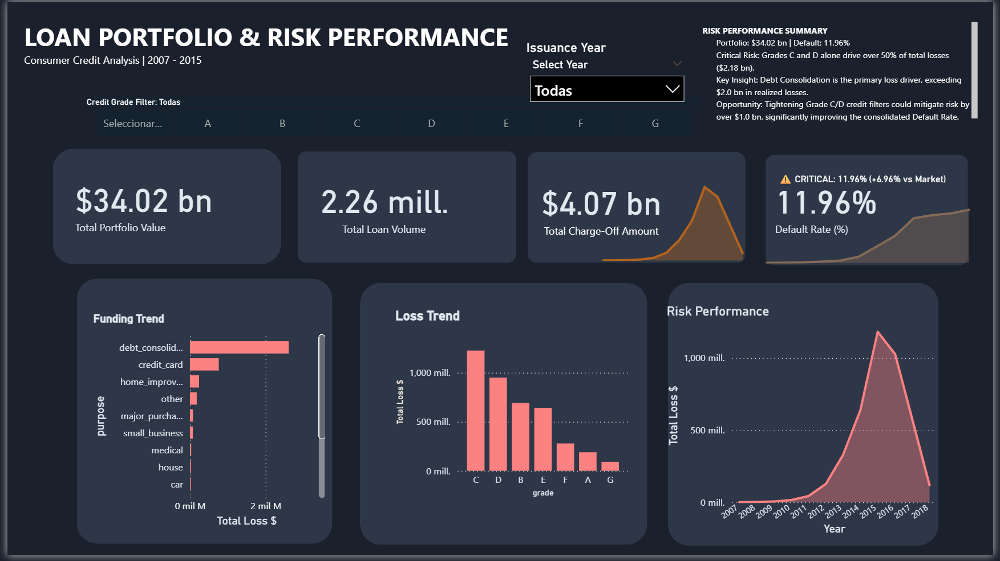

# Financial Credit Risk Analysis: High-Volume Portfolio Auditing (2.26M Records)

## 🎯 Executive Summary
This project delivers a deep-dive financial audit of a massive credit portfolio, identifying systemic risks that led to a total realized loss of **$4.07 Billion USD**. By processing **2,260,668 records** (1.10 GB) in **PostgreSQL**, the analysis pinpoints high-risk segments where volume and default rates intersect to cause significant capital leakage.

---

## 🎨 Visual Intelligence (Power BI)
*Integrating business logic with high-impact visualization for executive decision-making.*

### 🖼️ Dashboard Preview
 

### 🧠 Advanced Analytics & DAX
Custom **DAX measures** were engineered to provide deep business context:
* **Risk Performance (Sparklines):** Time-series trend indicators to visualize loss velocity across credit vintages.
* **Dynamic Default Velocity:** Comparative calculation of the portfolio's default rate against market benchmarks (11.96% vs 7.79%).
* **Interactivity:** Cross-filtered environment for drilling down from $34B in total exposure to specific "Debt Consolidation" leakages.

---

## 📊 Key Business Findings
- **Total Realized Loss:** Identified **$4.07 Billion USD** ($4,068.9M) in 'Charged Off' loans.
- **The Grade C Paradox:** While Grade G has the highest failure rate (36.83%), **Grade C** is the primary driver of loss, totaling **$1.22 Billion** due to its extreme volume in the portfolio.

### 👤 High-Risk Profile Quantification
| Profile | Total Loans | Default Rate | Millions Lost |
| :--- | :--- | :--- | :--- |
| **Grade C + Debt Consolidation** | **387,312** | **13.20%** | **$777.12** |
| **Grade C + Credit Card** | 130,553 | 12.68% | $256.50 |
| **Grade G + Debt Consolidation** | 7,594 | **37.78%** | $60.23 |

*Data extracted via SQL aggregation in pgAdmin.*

---

## 🛠️ Tech Stack & Engineering
* **Database:** PostgreSQL (Optimized for large-scale data ingestion).
* **Visualization:** Power BI Desktop (DAX, Power Query).
* **Performance:** Achieved high-speed bulk ingestion of 2.26M rows in **48.8 seconds** using the `COPY` command.
* **Architecture:** Implemented a **Gold Layer (View)** to normalize raw data and create boolean risk flags (`is_bad_loan`) for high-performance calculations.

## 🔍 Data Quality Audit
* **Null Management:** Detected **166,931 missing job titles**, **1,711 null DTI records**, and **4 null income records**.
* **Dirty Data Detection:** Identified "999" DTI placeholders associated with null IDs, requiring exclusion to prevent skewed insolvency metrics.
* **Outlier Isolation:** Identified extreme income anomalies (up to $110 Million USD) and DTI ratios of 173%.

## 💡 Strategic Recommendations
1. **Targeted DTI Friction for Grade C:** Implement a strict **30% DTI cap** for "Debt Consolidation" within Grade C to mitigate losses in this $777M segment.
2. **Efficiency-Based Rejection for Grade G:** Immediate rejection of "Debt Consolidation" applications in Grade G due to the critical **37.78% default rate**.
3. **DTI Outlier Hard Cap (>40%):** Automatic rejection for any applicant exceeding 40% DTI to prevent extreme insolvency cases.

---
> **Professional Disclaimer:** This project focuses on exploratory and descriptive risk analysis; no predictive modeling was implemented at this stage.

*Created by **Paul Mendoza** - Junior Data Analyst*